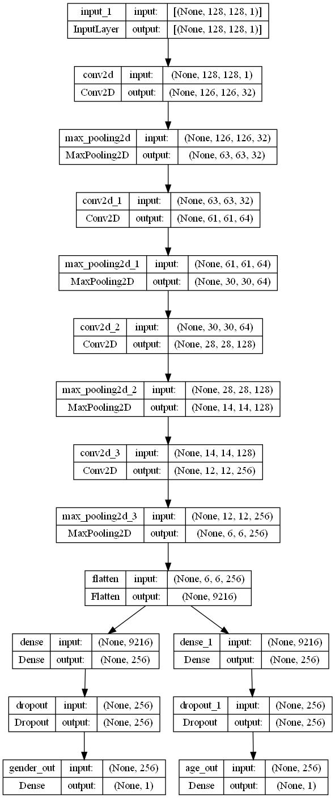
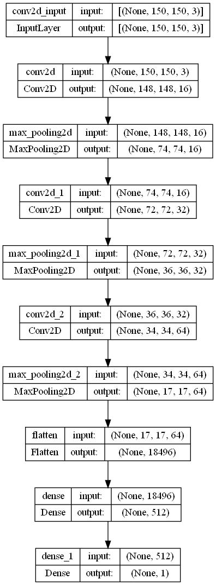

# 🧠 Face Recognition System

This project is a complete face recognition pipeline that integrates:
- ✔ Face Identification  
- ✔ Age & Gender Estimation  
- ✔ Face Mask Detection  

Each module is powered by deep learning models and classic face recognition techniques.

---

## 🎥 Demo Video
Watch the full demonstration of the system here:

👉 **[Demo Video](https://drive.google.com/file/d/1GrZni8NgTZKUI0Arhmc_81rZM96HASZ7/view?usp=sharing)**

---

# 📌 Features

## 1️⃣ Face Identity Recognition
This module uses the **face_recognition** Python library to:
- Detect faces  
- Encode facial features  
- Compare embeddings to known identities  

This ensures fast and accurate real-time face matching.

---

## 2️⃣ Age & Gender Estimation
This module uses a **CNN model** trained to classify:
- Age range  
- Gender  

### 🔍 Model Architecture
The architecture image is located in the project folder:

---

## 3️⃣ Face Mask Detection
A second CNN model is used to detect whether a person is:
- Wearing a mask 😷  
- Not wearing a mask 🙂  

### 🔍 Model Architecture
Architecture visualization:

---

## 🚀 Technologies Used
- Python  
- face_recognition (dlib)  
- TensorFlow / Keras  
- OpenCV  
- CNN-based custom models  

---

## 📁 Project Structure (Optional)
